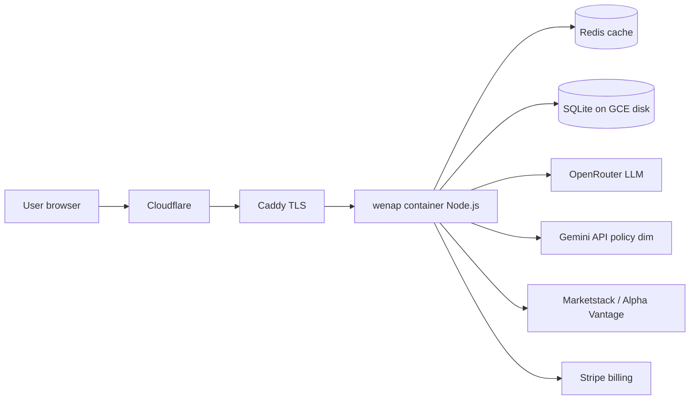

# DeveloperWeek New York 2026 Hackathon — Wenap 提交指南

> **官方页**：https://dwny-2026-hackathon.devpost.com/  
> **截止**：2026-06-10 **10:00 EDT**（东京约 6/10 23:00）  
> **形式**：线上即可提交，不必到场（TWA Hotel 6/9–10 为线下场）  
> **策略**：用**已上线的 Wenap** 冲 **Overall** 主奖；评委看 Progress / Concept / Feasibility，不必接赞助商子挑战。

---

## 今天要做的事（约 2–3 小时）

| 顺序 | 任务 | 时间 |
|:---:|------|:----:|
| 1 | Devpost **Register** 该 hackathon | 5 min |
| 2 | 新建 **Submission**（可单人 team） | 10 min |
| 3 | 录 **2–3 分钟** demo 视频（YouTube 未列出也可上传 Devpost） | 60 min |
| 4 | 填 Project overview + details + 链接 | 30 min |
| 5 | 可选：architecture 图 1 张 | 30 min |
| 6 | **Submit**（截止前仍可改） | 5 min |

---

## 注册

1. 登录 Devpost（与 XPRIZE 同一账号即可）。
2. 打开 https://dwny-2026-hackathon.devpost.com/ → **Register** / Join hackathon。
3. 完整说明（官方）：页面上的 **Full Set of Instructions** 链接。

---

## 冲哪条赛道？

| 赛道 | 建议 |
|------|------|
| **Overall（主奖）** | ✅ **首选**。Wenap 已是完整 Web SaaS，Progress 满分叙事。 |
| Tower Pipeline（dbt + lakehouse） | ⚠️ 除非你愿意写 Tower 集成故事；Wenap 主栈是 Docker+Redis+SQLite，不必硬凑。 |
| Nimble（实时网页 Agent） | ⚠️ 需用 Nimble API；Wenap 未集成，**跳过**省时间。 |
| name.com Domain Roulette | ❌ 随机域名再造产品，与 Wenap 无关。 |

**结论**：只交 **Overall**，项目名称仍叫 **Wenap**。

---

## 评委看什么（对齐文案）

| 维度 | Wenap 怎么答 |
|------|----------------|
| **Progress** | 已 production deploy（wenap.app）；Docker Compose + GCE 持久盘；Redis 缓存；预测验证 cron；非 weekend prototype。 |
| **Concept** | Retail investors lack structured, cited research; Wenap turns tickers into 6-dimension reports in ~60s. |
| **Feasibility** | Free 5/mo + Stripe Pro/Pro+；public `/accuracy`；multi-asset; compliance disclaimers. |

---

## Devpost 字段 — 可直接粘贴（英文）

### Project name

```
Wenap
```

### Tagline / Elevator pitch（约 200 字）

```
Wenap is an AI-native investment research workspace for retail investors. Enter a ticker (stocks, ETFs, REITs, forex, crypto) and get a structured report in about a minute: six-dimension radar, bull/base/bear scenarios, supply chain map, and verifiable 30-day prediction tracking. Built as production SaaS on Google Cloud with Docker, Redis, and a multi-model orchestration pipeline—not a hackathon-only demo.
```

### Description（长描述，可再扩）

```markdown
## Problem
Retail investors face fragmented news, opaque AI chat answers, and no way to verify whether AI "calls" were right.

## Solution
Wenap produces compliance-aware, structured equity research with cited sources, freshness warnings, and a public accuracy ledger at /accuracy.

## What we built (progress during hackathon window)
- Live product: https://wenap.app
- GCP VM deployment with Docker Compose (app + Redis), persistent SQLite on disk
- Multi-step AI orchestration: Pro+ hybrid pass (Haiku + Flash Lite), policy dimension, critic review
- Market data: Marketstack + Alpha Vantage fallback; JP/HK symbol resolution
- SaaS tiers: Free (5 analyses/month), Pro, Pro+ (AI screener, compare, risk alerts)
- Admin ops: cost tracking, prediction verification, system health

## Tech stack (for engineering judges)
- Frontend: React + Vite
- Backend: Node.js monolith (server.cjs)
- Cache: Redis
- DB: SQLite on persistent volume
- LLM: OpenRouter + optional Gemini API for policy/regulation dimension
- Edge: Cloudflare → Caddy → Docker

## Disclaimer
Not financial advice. For research and education only.
```

### Built with（技术标签）

```
React, Node.js, Docker, Redis, SQLite, Google Cloud Platform, OpenRouter, Gemini API, Stripe, Cloudflare
```

### Links（必填尽量全）

| 字段 | URL |
|------|-----|
| **Try it** / Demo | https://wenap.app |
| **Sample report** | https://wenap.app/sample/NVDA |
| **Public accuracy** | https://wenap.app/accuracy |
| **GitHub** | https://github.com/gugu8283-cpu/Wenap |
| **Video** | （你上传 YouTube 后的链接） |

### Testing instructions（给评委）

```
1. Open https://wenap.app/sample/NVDA (no login) for a sample report.
2. Register free at https://wenap.app/register — verify email.
3. Run one analysis: ticker NVDA or AAPL, asset Stock, horizon 1M, English.
4. Optional Pro+ test account (if you provide in Devpost private note): [你的测试账号]
Free tier: 5 analyses per month after email verification.
```

---

## Demo 视频脚本（建议 2:00）

| 时间 | 画面 | 旁白（英） |
|------|------|------------|
| 0:00 | 首页 logo | "Wenap — AI investment research for retail investors." |
| 0:15 | /sample/NVDA 滚动 | "Structured report: radar, scenarios, sources—with stale-data warnings." |
| 0:45 | 注册 → 分析 AAPL 加载 | "Under the hood: multi-model orchestration and Redis-cached pipeline on GCP Docker." |
| 1:30 | /accuracy 页 | "We track predictions publicly—direction accuracy over 30 days." |
| 1:50 | deploy 架构图或 `docker compose ps` | "Production: Docker Compose, Redis, persistent SQLite on GCE." |
| 2:00 | wenap.app + 免责字卡 | "Not financial advice. wenap.app" |

上传 **YouTube 公开** 或 Devpost 托管，把链接贴进 submission。

---

## 架构图（给幻灯片或 Devpost 图）



截图来源：GCE 上 `docker compose -f deploy/docker-compose.gce.yml ps` + 此图。

---

## 团队

- **单人**即可；Devpost 建 team 时只有你一人没问题。
- 不必为 hackathon 新建仓库；用现有 **gugu8283-cpu/Wenap**。

---

## 提交后

- 截止前可在 Devpost **Edit** 改文案/视频。
- 6/11 接着准备 **Google Cloud Rapid Agent**（别与本次字段混用同一草稿，另开 submission）。

---

## 检查清单（Submit 前勾选）

- [ ] 已 Register hackathon
- [ ] Try it = https://wenap.app 可打开
- [ ] 视频 ≤3 min，声音/字幕清楚
- [ ] 文案含 **Not financial advice**
- [ ] 未写邀请送 Pro / referral（已关闭）
- [ ] GitHub 无 `.env` 密钥泄露

---

## 相关文档

- 总览：`docs/WENAP-参赛与宣传总览-给AI.md`
- XPRIZE 长线：`docs/XPRIZE-参赛全流程-手把手.md`
